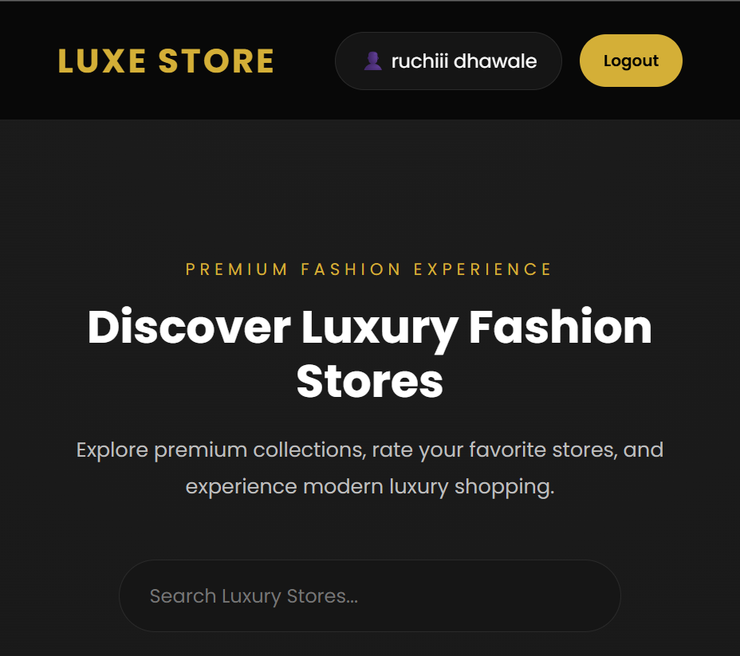
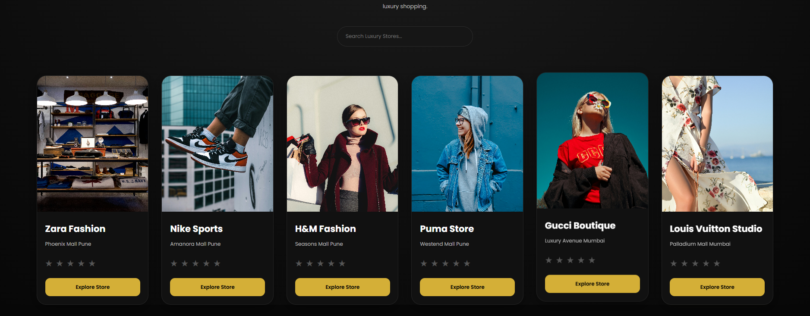
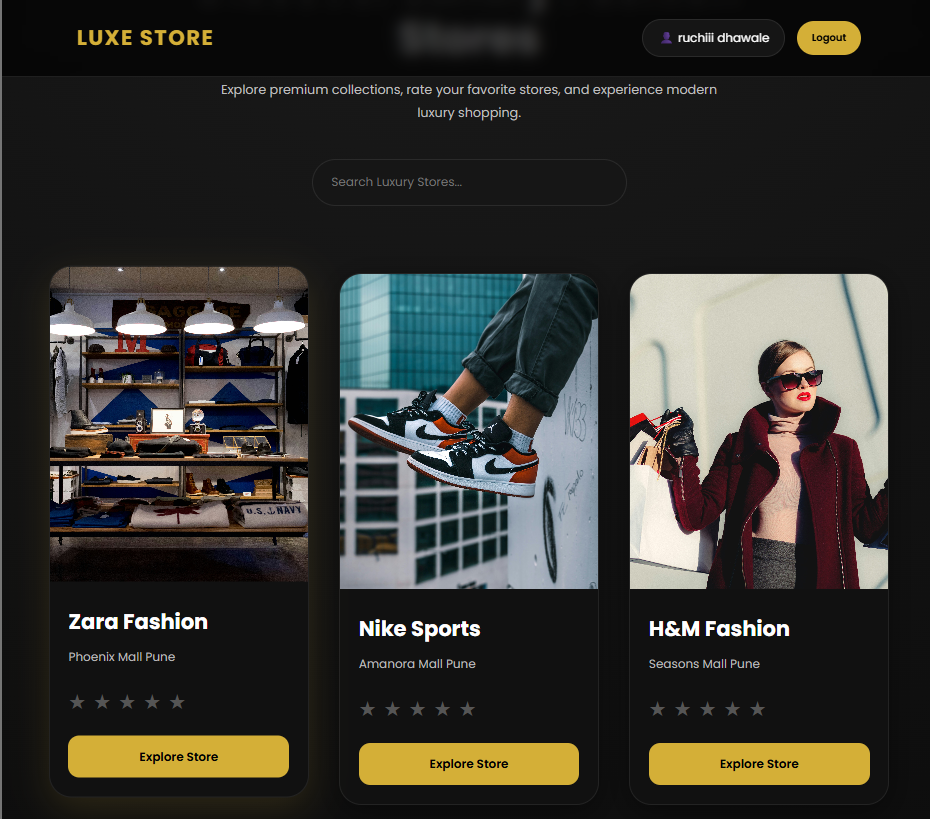
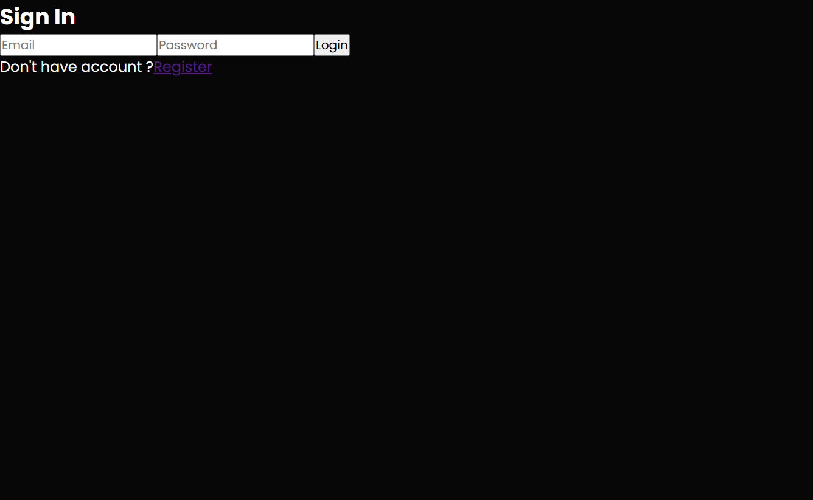
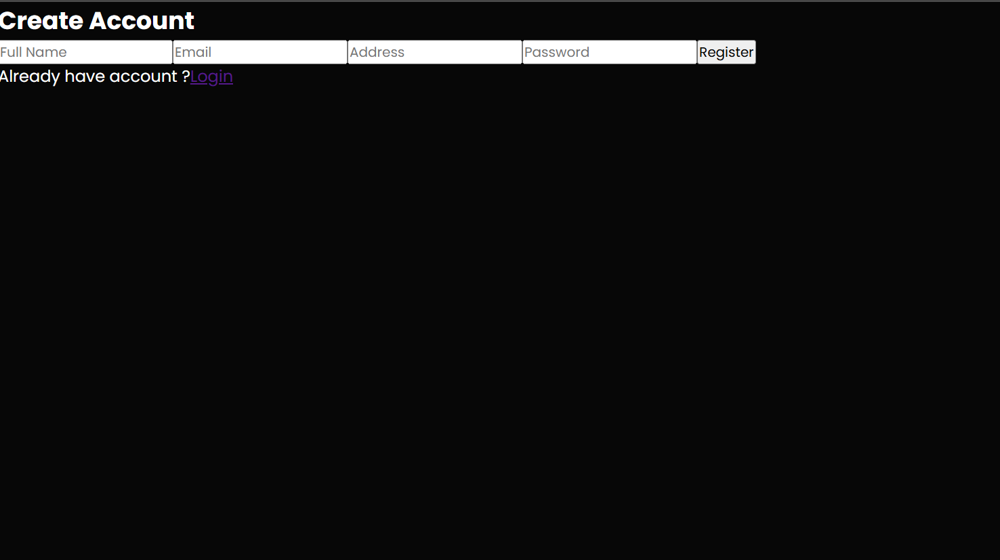
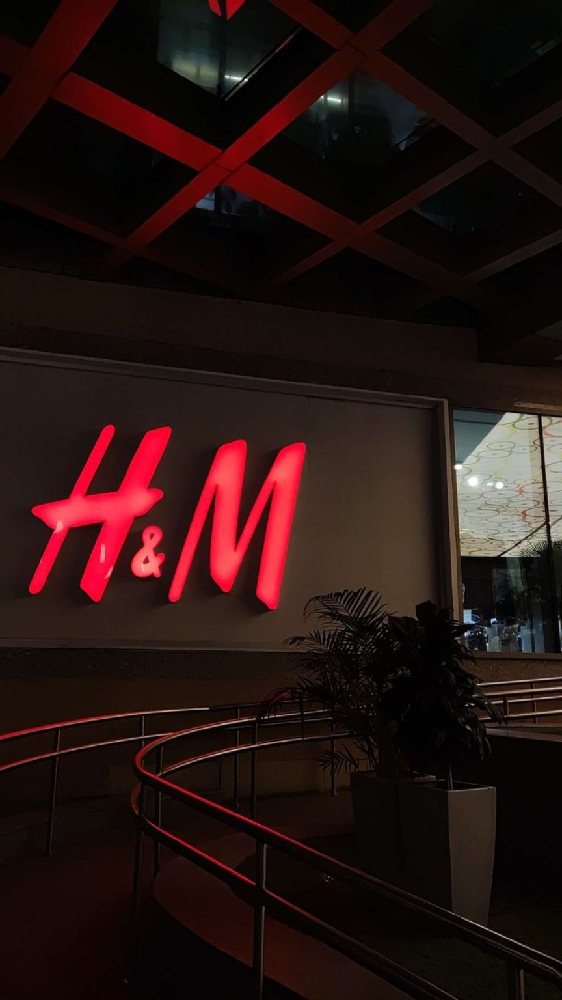
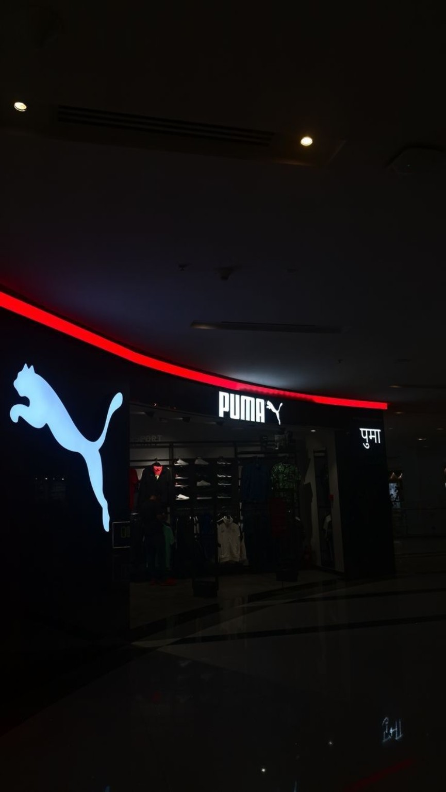
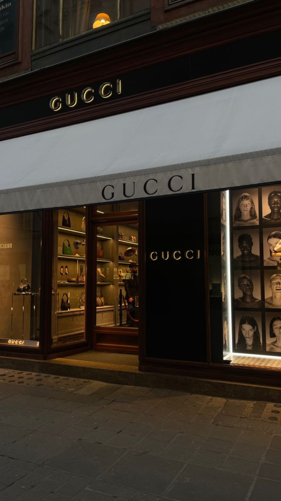

# Luxury Store Rating Platform

A modern MERN Stack luxury ecommerce-inspired web application where users can register, login, explore premium fashion stores, and submit ratings.

---

# Live Features

✅ User Registration  
✅ User Login Authentication  
✅ JWT Authentication  
✅ Password Encryption using bcryptjs  
✅ MongoDB Atlas Database  
✅ Luxury Dark UI Design  
✅ Responsive Store Cards  
✅ Dynamic Store Data  
✅ Store Rating System  
✅ Search Functionality  
✅ Explore Store Feature  
✅ Logout/Login Session Handling  

---

# Tech Stack

## Frontend
- React.js
- CSS3
- Axios
- React Router DOM

## Backend
- Node.js
- Express.js
- MongoDB Atlas
- Mongoose
- JWT
- bcryptjs

---

# Folder Structure

```bash
Roxiler-Assignment/

├── frontend/
├── backend/
├── screenshots/
├── README.md
```

---

# Installation Guide

## Clone Repository

```bash
git clone YOUR_GITHUB_REPO_LINK
```

---

# Backend Setup

```bash
cd backend
npm install
```

Create `.env` file:

```env
PORT=5000

MONGO_URI=YOUR_MONGODB_URI

JWT_SECRET=YOUR_SECRET_KEY
```

Run Backend:

```bash
npm start
```

---

# Frontend Setup

```bash
cd frontend
npm install
npm run dev
```

---

# Application Screenshots

## Home Page



---

## Luxury Store Listings



---

## Premium Cards UI



---

## Login Page



---

## Register Page



---

## Search Bar UI


---

# Luxury Brand Store Images

## Zara Fashion


---

## Nike Sports


---

## H&M Fashion



---

## Puma Store



---

## Gucci Boutique



---

## Louis Vuitton Studio


---

# Author

## Ruchita Dhawale

MERN Stack Developer